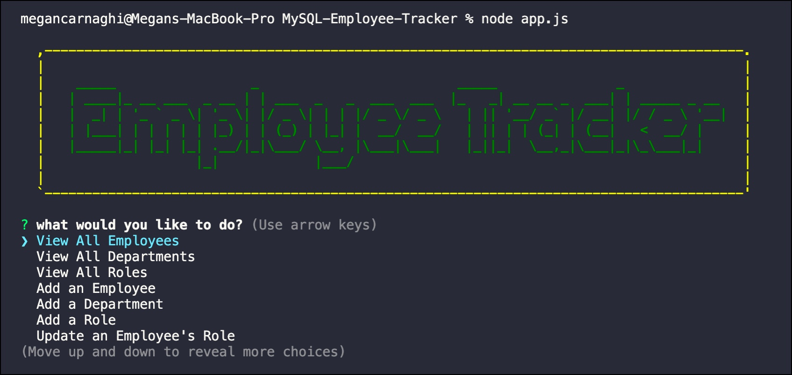

# MySQL-Employee-Tracker

## Table of Contents
* [Description](#description)
* [User Story](#user-story)
* [Installation](#installation)
* [Technologies Used](#technologies-used)
* [Links and Screenshot](#links-and-screenshot)

## Description
A command-line application for managing a company's employees using Node, Inquirer, and MySQL.

## User Story
As a business owner  
I want to be able to view and manage the departments, roles, and employees in my company  
So that I can organize and plan my business  

## Installation
To run the application locally, use the following command to clone this repository: 
`git clone https://github.com/MeganCarnaghi/MySQL-Employee-Tracker.git`  

Once you're in the proper directory, run the following command in the Terminal to install the application depndencies:  
`npm install`  

Next, run the following command to start the application: 
`node app.js`

## Technologies Used
* JavaScript
* Node
* NPM Packages (Inquirer, console.table, mysql, asciiart-logo)

## Links and Screenshot
* Link to GitHub Repository: https://github.com/MeganCarnaghi/MySQL-Employee-Tracker.git
* Link to Demo Video: 

© Megan Carnaghi, Michigan State University Full-Stack Web Development Bootcamp

